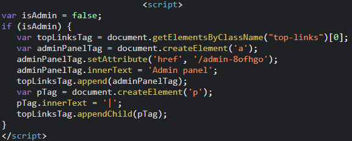

# Lab 1: Unprotected admin functionality
## Lab description:

    

## Solution:
* Truy cập vào robots.txt trên thanh URL, ta thấy một đường dẫn tới mội admin directory

    

* Truy cập vào đường dẫn đó, ta vào được trang admin

    

* Thực hiện xóa user carlos, và lab đã được solved

  

# Lab 2: Unprotected admin functionality with unpredictable URL
## Lab Description:

    

## Solution:
* Truy cập vào robots.txt trên thanh URL, nhưng không nhận được kết quả gì

    

* F12 check source, thấy được đoạn script sau

    

* Lên URL thử truy cập vào /admin.8ofhgo, ta vào được panel của admin

    

* Xóa user carlos và lab đã được solved

  

# Lab 3: User role controlled by request parameter
## Lab Description:

    

## Solution:
* Đăng nhập bằng tài khoản của wiener

    

* Bắt request lúc load lại trang, thấy có một cookie tên Admin=false

    

* Sửa giá trị của cookie đó thành true rồi gửi request, ta thấy có thêm một mục nữa là Admin panel

    

* Truy cập vào mục đó, xóa carlos và lab đã được solved

  

# Lab 4: User role can be modified in user profile
## Lab Description:

    

# Solution: 
* Đăng nhập vào tài khoản wiener, ta thấy trường thay đổi email

    

* Sử dụng email bất kỳ để update, sau đó bắt request gửi sang Repeater. Xem response trả về, thấy được kết quả được trả dưới dạng JSON và email đã được đổi

    

* Đổi roleid sang 2 (lab bảo thế), rồi gửi response

    

* Quay lại trang, thấy đã xuất hiện thêm mục Admin Panel

    

* Vào đó, xóa carlos và lab đã được solved

  

# Lab 5: URL-based access control can be circumvented
## Lab Description:

    

## Solution:
* Khi vào lab, thấy mục Admin panel, truy cập vào thì thấy bị từ chối. Nhưng đường dẫn chứa tới trang /admin

    

* Bắt request của trang, sử dụng header X-Original-URL với giá trị /admin xuất hiện trên thanh URL

    

* Gửi request thì ta được trang Admin panel, bắt request khi xóa người dùng thấy xuất hiện trang /admin/delete. Và đương nhiên khi forward request này sẽ quay trở lại trang Access denied vì đây là thao tác trên trang của admin, nhưng mình thì bị chặn thao tác trên đó

    

* Quay trở lại trang ban đầu, thay giá trị của X-Original-URL thành /admin/delete, truyền lên bên trên tham số ?username=carlos

    

* Gửi request thì người dùng carlos đã bị xóa, và lab đã được solved

  

# Lab 6: Method-based access control can be circumvented
## Lab description:

    

## Solution:
* Vào lab, đăng nhập với người dùng administrator, vào Admin panel thấy giao diện sau

    

* Bắt request khi upgrade user carlos, ta nhận được request POST sau

    

* Ném request sang Repeater, rồi log out để log in vào tài khoản của wiener (ko phải admin). Bắt mội request bất kỳ để lấy cookie session, sau đó cop giá trị ném sang cookie ở bên Repeater kia, nhận được kết quả trả về là Unauthorized

    

* Chuột phải vào request rồi chọn Change request method, sửa các giá trị trên tham số thành như sau

    

* Gửi request, và lab đã được solved

  

# Lab 7: User ID controlled by request parameter
## Lab Description:

    

## Solution:
* Đăng nhập vào tài khoản của wiener, ta thấy được API key của tài khoản cũng như URL xuất hiện param id = wiener

    

* Thay giá trị của id thành carlos, ta nhận được trang tài khoản của carlos

    

* Submit API key cho lab, và lab được solved

  

# Lab 8: User ID controlled by request parameter, with unpredictable user IDs
## Lab Description:
## Solution:
* Đăng nhập vào tài khoản của wiener, ta thấy được API key của tài khoản cũng như URL xuất hiện param id với giá trị rất ngẫu nhiên

    

* Thử fuzzing quanh app để xem các tài khoản khác, tìm post được đăng tải bởi carlos

    

* Bấm vào link tài khoản carlos, thấy giá trị của id thay đổi. Rất có thể đây là id của carlos

    

* Copy giá trị đó, vào My account rồi paste thay giá trị của mình. Ta nhận được chuyển hướng tới trang của carlos

    

* Submit API key cho lab, và lab được solved

  

# Lab 9: User ID controlled by request parameter with data leakage in redirect
## Lab Description:
## Solution:
* Đăng nhập vào tài khoản của wiener, ta thấy được API key của tài khoản cũng như URL xuất hiện param id = wiener. Thay id thành carlos, ta lập tức bị đẩy về trang login
* Bắt request trước khi bị đẩy về login, ném sang Repeater, ta nhận được response chuyển hướng, kèm theo đó body là trang của carlos

    

* Submit API key cho lab, và lab được solved

  

# Lab 10: User ID controlled by request parameter with password disclosure
## Lab Description:

    

## Solution:
* Đăng nhập vào tài khoản của wiener, ta thấy được trang tài khoản cũng như URL xuất hiện param id = wiener. Thay id thành administrator, ta được tới trang của admin luôn

    

* Ném sang Repeater, ta xem được response chứa pass

    

* Đăng nhập bằng tài khoản administrator, xóa carlos, và lab đã được solved

  

# Lab 11: Insecure direct object references
## Lab Description:
## Solution:
* Vào mục Live chat, thấy có vẻ là chat với AI. Nhắn vài dòng rồi ấn View transcript, thấy tải về một file text

    

* Vào Burp, xem HTTP history thì thấy request này. Ném sang Repeater để xem response

    

* Để ý mỗi lần ấn View transcript cho 1 bản tải về với tên là số tăng dần. Vào Repeater đọc file 1.txt

    

* Copy pass để đăng nhập, và lab được solved

  

# Lab 12: Multi-step process with no access control on one step
## Lab Description

    

## Solution:
* Đăng nhập vào tài khoản administrator, vào Admin panel, thấy được chức năng thay đổi role

    

* Upgrade role của carlos lên, thấy hiện trang confirm

    

* Vào HTTP History thấy request thay đổi role có dạng như sau: action, confirmed, username

    

* Ném request đó sang Repeater rồi logout để login vào tài khoản wiener, sau đó lấy session của wiener thay vào session trong Repeater. Đổi username dưới body của request thành wiener

    

* Gửi request, và lab được solved

  

# Lab 13: Referer-based access control
## Lab Description: 

    

# Solution:
* Đăng nhập vào tài khoản administrator, vào Admin panel, thấy được chức năng thay đổi role

    

* Upgrade role của carlos lên, rồi bắt request đó ném sang Repeater

* Logout để login vào tài khoản wiener, lấy session rồi thay vào giá trị trong Repeater, đổi username thành wiener. Có thể thấy trong request có header Referer nên mới có thể gửi được

    

* Nếu ta bỏ header đó đi, ta nhận được response là Unauthorized. Gửi xong request trên và lab được solved