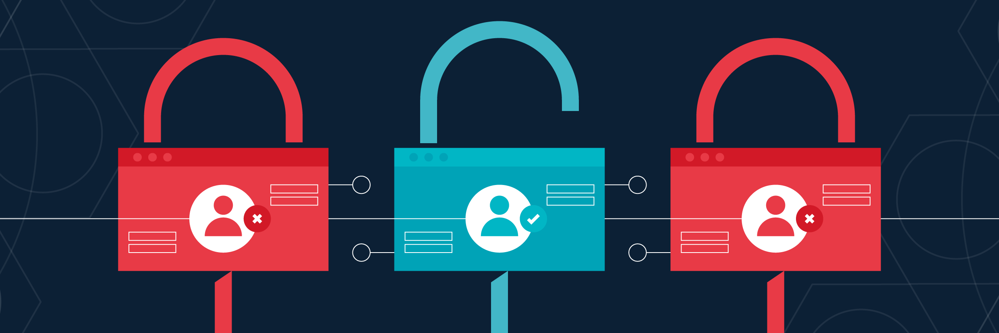
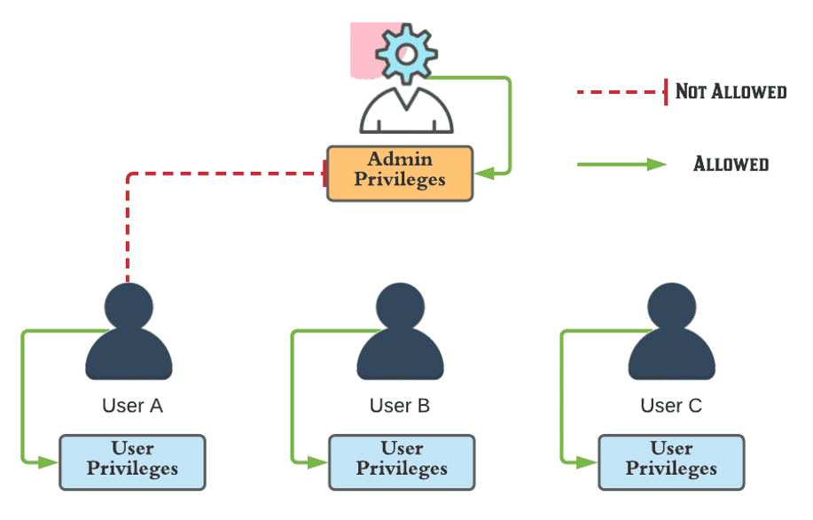
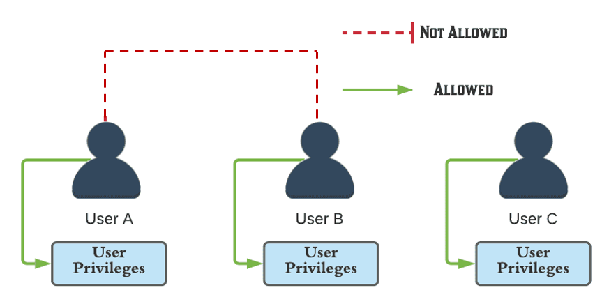
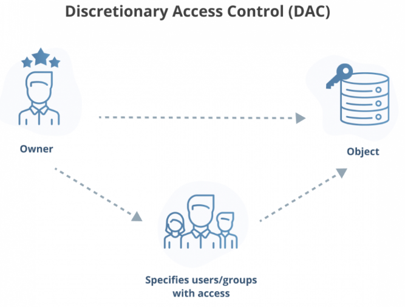
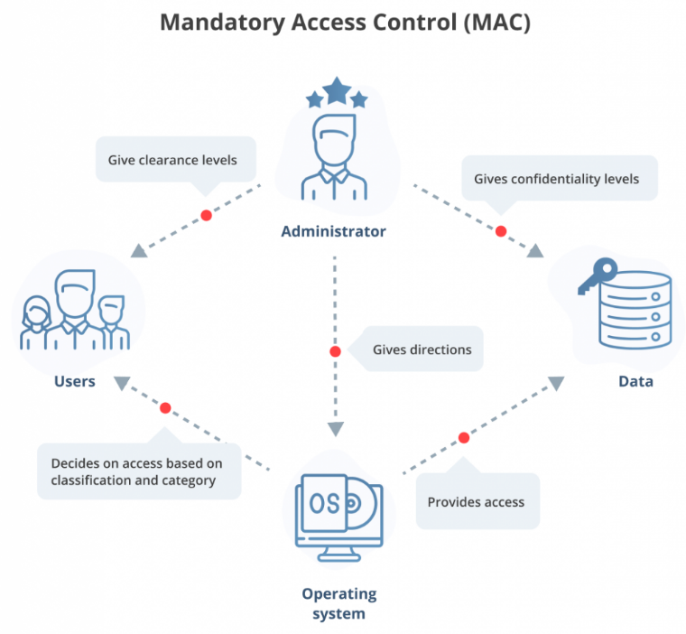
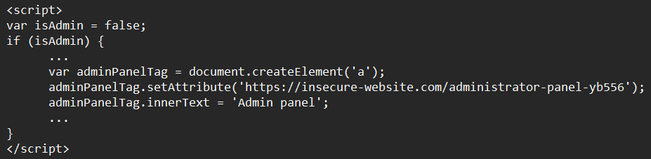
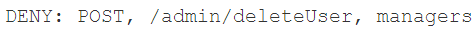
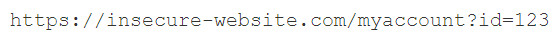
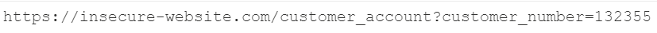
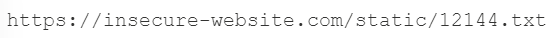

# I. Khái niệm Broken Access Control
## **Khái niệm Access Control:**

    

* Access Control (hoặc Authorization) là việc đặt các hạn chế lên người dùng, cho phép ***ai được làm gì*** hoặc ***truy cập vào nguồn tài nguyên gì***. Nói cách khác, Access Control ***không cho phép*** người dùng ***thực hiện*** những hành động mà họ ***không có quyền***
* Trong các web app, Access Control phụ thuộc vào ***authentication*** (sự xác thực) và ***session management*** (quản lý session):
    * *Authentication*: xác thực người dùng
    * *Session management*: nhận dạng các requests sau đó của người dùng

    ↪ Như vậy, Access Control quyết định xem người dùng ***có thể thực hiện được*** các hành động mà họ đang muốn thực hiện hay không
* Broken Access Control (BAC): là việc các khâu ***kiểm duyệt truy cập*** của người dùng không chặt chẽ, dẫn đến nguy cơ ***truy cập trái phép*** tài nguyên hoặc ***thực hiện trái phép*** các hành động của người dùng

 

## **Phân loại Access Control:**
### *1. Vertical access controls:*

    

* Là cơ chế giới hạn quyền truy cập tới những ***chức năng, tài nguyên*** mà chỉ những ***người được cấp quyền*** mới thực hiện được (khác đẳng cấp)
* Vertical access control không cho phép người dùng không có quyền X thực hiện những chức yêu cầu quyền X đó. Nói cách khác, người dùng có ***quyền thấp*** ***không được thực hiện*** những ***chức năng*** của người có ***quyền cao hơn***
* Nếu BAC xảy ra ở đây, người dùng có thể thực hiện được những ***hành động yêu cầu quyền cao hơn***

    VD: chỉ admin mới có thể thay đổi hoặc xóa người dùng, còn người dùng thường thì không làm được điều này. Nhưng nếu BAC, người dùng vẫn có thể, bằng cách nào đấy, thực hiện được

### *2. Horizontal access controls:*

    

* Là cơ chế giới hạn quyền truy cập tới những ***chức năng, tài nguyên*** chung nhưng chỉ có thể là của ***chính người dùng*** (cùng đẳng cấp)
* Horizontal access control cho phép các ***người dùng khác nhau*** truy cập vào những phần khác nhau của ***cùng một kiểu*** tài nguyên. Tức không ai được phép sử dụng tài nguyên của người khác
* Nếu BAC xảy ra ở đây, người dùng có thể thực hiện được những ***hành động của người dùng có cùng quyền*** khác

    VD: ở những app ngân hàng, tất cả mọi người đều có thể thanh toán bằng. Nhưng người dùng chỉ có thể thực hiện thanh toán bằng tài khoản của chính mình chứ không phải cả của người khác

### *3. Context-dependent access controls:*
* Là cơ chế giới hạn quyền truy cập vào những ***chức năng và tài nguyên*** dựa trên ***trạng thái của app*** lúc bấy giờ hoặc ***sau những hành động, tương tác*** nào đó mà người dùng đã thực hiện 
* Context-dependent access control ngăn người dùng thực hiện các hành động với ***trình tự khác*** với mục đích của app

    VD: các wecho phép người dùng thay đổi nội dung trong giỏ hàng đã thanh toán (VD: thay đổi số lượng, bsite bán hàng không thay đổi mặt hàng...) 

 

## **Access control security models (Các khuôn mẫu bảo mật cho Access Control):**
### *Khái niệm:*
* Khuôn mẫu bảo mật cho Access Control là một set các cách để thực hiện Access Control 
* Những khuôn mẫu này thường được triển khai trong hệ điều hành, các hệ thống quản lý cơ sở dữ liệu, bên server...

### *Phân loại:*
*1. Programmatic access control:*
* Tự lập trình ra một ***ma trận người dùng*** với các đặc quyền khác nhau

*2. Discretionary access control (DAC - tạm dịch: điều khiển truy cập tùy ý):*

    

* Quyền truy cập vào tài nguyên hoặc các chức năng bị giới hạn cho ***người dùng*** hoặc một ***nhóm người dùng*** được cấp phát
* Chủ sở hữu ***có thể*** cấp hoặc tước đi quyền truy cập của bất cứ ai
* Phức tạp để thiết kế và quản lý vì có nhiều chi tiết
* Thường được áp dụng cho các doanh nghiệp vừa và nhỏ

*3. Mandatory access control (MAC - điều khiển truy cập bắt buộc):*

    

* Quyền truy cập vào tài nguyên bị giới hạn bởi ***mức độ bảo mật*** của chính tài nguyên đấy và ***quyền hạn*** của người muốn truy cập vào tài nguyên đó
* Chủ sở hữu ***không thể*** thay đổi hoặc tước quyền truy cập của người khác
* ***Bảo mật nhất*** trong các khuôn mẫu
* Thường được áp dụng cho chính phủ, quân sự, luật pháp...

*4. Role-based accesss control (RBAC):*
* Quyền truy cập vào tài nguyên phụ thuộc vào ***role của người truy cập***
* Người dùng có thể có ***nhiều roles*** để truy cập vào những ***tài nguyên khác nhau***
VD: Trong Discord có nhiều roles để thực hiện được các chức năng hoặc vào được các nhóm hội thoại khác nhau

 

# II. Cách khai thác
## **Leo quyền theo chiều dọc:**
### *1. Thông qua bảo mật không chặt chẽ:*
* Qua URL (nếu mục tiêu không có tí bảo mật nào) bằng cách ***truy cập trực tiếp*** tới các trang mình muốn nếu biết tên
* Có thể thông qua file ***robots.txt*** để lấy được đường link dẫn tới các pages của admin
* Nếu không tìm được link, có thể ***brute force***
* Nhiều trường hợp một số pages có đường dẫn với những tên ***khó brute force ra*** (security by obscurity). Nhưng trong đó, một số trường hợp vẫn có thể leak được URL thông qua code front-end phụ thuộc vào role của người dùng

VD: Xét đoạn code sau có thể xem được bằng cách F12

    

* Dễ đoán là nếu user có role admin, đoạn script sẽ thực thi. Nhưng chả cần đến role, mình vẫn đọc được script

### *2. Thông qua quản lý truy cập bằng tham số (Parameter-based Access Control):*
* Một số app sử dụng ***role của người dùng*** khi đăng nhập vào, và cái role này, nhiều lúc, có thể ***chỉnh sửa được*** bởi chính người dùng
* Chỉ cần ***đổi giá trị phù hợp*** của role là có thể leo được quyền

### *3. Do cấu hình sai của server:*
* Một số apps giới hạn truy cập vào một số ***URLs*** nào đó hoặc các ***giao thức HTTP*** dựa trên role của người dùng (***URL-based Access Control*** và ***Method-based Access Control***)

VD: cấu hình sau sẽ ngăn người dùng ở nhóm *managers* thực hiện các giao thức *POST* ở trong trang */admin/deleteUser*

    

* Nhưng đôi khi app sử dụng framework hỗ trợ các HTTP header không chính thống, gây ra sự ***ghi đè URL***, như ***X-Original-URL*** hoặc ***X-Rewrite-URL***
* Ngoài ra cũng có thể khai thác thông qua các giao thức HTTP bằng cách ***thay đổi giữa các giao thức***, với trường hợp các websites được cấu hình sao cho việc sử dụng các giao thức khác nhau vẫn có thể thực hiện được hành động 

 

## **Leo quyền theo chiều ngang:**
* Cách khai thác nhiều chỗ tương tự như theo chiều dọc
* Ta có thể truy cập vào URL của người khác nếu ta biết được, và đương nhiên đây là trường hợp đơn giản nhất rồi

    VD: mỗi user có một id riêng. Mỗi lần truy cập vào trang sẽ có đoạn URL sau:

    

Nhưng nếu thay đổi param id thành giá trị khác, ta có thể truy cập được vào tài khoản của người khác

* Đôi khi, giá trị của param có thể khó đoán, ví dụ như được gắn thêm một đoạn ***UUID*** (Universal Unique Identifier). Nhưng nếu chịu khó mần mò thêm cái app (và may mắn) thì có thể sẽ tìm ra được id của người khác, như thông qua tin nhắn, review, comment... của người đó

* Có vài trường hợp, app phát hiện ra khi người dùng truy cập trái phép vào trang nào đó sẽ bị ***chuyển hướng*** sang bất kỳ trang nào khác. Tuy nhiên, từ cái ***phản hồi redirect*** đó có thể chứa một vài thông tin quan trọng của người dùng bị tấn công

 

## **Leo quyền từ ngang sang dọc:**
* Thực tế, leo quyền ngang có thể chuyển thành leo quyền dọc bằng cách ***truy cập vào tài khoản có quyền cao hơn***, dẫn tới truy cập trực tiếp các chức năng cấp cao (sủa, xóa...)

 

## **Tham chiếu trực tiếp đối tượng không an toàn (Insecure direct object reference - IDOR):**
* Là một loại của BAC xảy ra khi app sử dụng ***input từ người dùng*** để ***truy cập trực tiếp*** tới các đối tượng => dễ dàng có thể thêm thắt input sao cho leo quyền
* Thế nào là object reference (OR)? Khi các endpoint của URL có dạng như key=value
* Nằm trong OWASP 2007 Top 10
* Nguyên nhân dẫn đến IDOR:
    * Phân quyền không đúng
    * Kiểm soát không chặt chẽ việc truy cập tài nguyên của người dùng trên hệ thống

↪ Tiềm ẩn nguy cơ truy cập trái phép
* Có một ext trên Burp chuyên để check IDOR có tên là ***Autorize***

### *IDOR thông qua tham chiếu trực tiếp tới các phần tử trong cơ sở dữ liệu:*
* Đoạn URL sau truy cập tới một trang của khác hàng thông qua param customer_number

    

* Nếu không có bất kỳ sự kiểm soát nào khác, chỉ cần thay đổi giá trị của param là cũng có thể truy cập được vào trang của người khác (BHAC), thậm chí lấy được cả trang của admin (BVAC)

### *IDOR thông qua tham chiếu trực tiếp tới các static files*
* Đoạn URL sau có thể khiến bất kỳ ai cũng có thể đọc được nội dung của các files khác bằng cách tìm được quy luật và thay đổi giá trị tương ứng

    

 

## **Access Control qua nhiều bước kiểm duyệt**
* Nhiều web thực hiện triển khai ***khâu kiểm duyệt nhiều bước***, thường là thông qua nhập hoặc chọn cái gì đó, hoặc cần xác thực chi tiết nào đó trước khi bắt đầu hành động nào đó

VD: để sửa thông tin người dùng, cần thông qua các bước sau:

    1. Thực hiện điền các thông tin cần đổi
    2. Ấn nút gửi
    3. Review lại và confirm

* Đôi khi trong 3 bước trên sẽ có 1 bước code ẩu, nên từ đó có thể khai thác sự ẩu đó

 

## **Access Control dựa vào header Referer**
* Có những web dựa vào ***header Referer*** để quản lý truy cập. Referer thường được cho vào request bởi trình duyệt để cho biết cái trang mà request được tạo ra là ở đâu

VD: triển khai Access Control ở page /admin, nhưng những sub-page như /admin/deleteUser thì mới kiểm tra Referer. Nên nếu header Referer đó chứa URL từ /admin, request sẽ được chấp nhận (không bị Drop)

 

## **Access Control dựa vào vị trí**
* Có cả những app thực hiện Access Control thông qua ***vị trí địa lý*** của người dùng
* Cái này có thể được bypassed thông qua ***web proxy***, hoặc ***VPN***, hoặc những cơ chế thay đổi vị trí địa lý khác mà bên client có thể thực hiện được

 

# III. Cách phòng chống
* Luôn từ chối truy cập trừ khi nó được truy cập chung cho mọi người
* Triển khai thông qua các khuôn mẫu một cách chặt chẽ, đầy đủ
* Nên tái sử dụng nhiều lần, và kiểm tra nhiều lần

# Tài liệu tham khảo:
* https://portswigger.net/web-security/access-control
* https://owasp.org/Top10/A01_2021-Broken_Access_Control/
* https://www.vnetwork.vn/news/web-security
* Các models:
    * https://portswigger.net/web-security/access-control/security-models
    * https://www.ekransystem.com/en/blog/mac-vs-dac
    * https://www.ibm.com/docs/en/zos/2.3.0?topic=environment-mandatory-access-control-mac
    * https://www.techtarget.com/searchsecurity/definition/mandatory-access-control-MAC
* IDOR: 
    * https://viblo.asia/p/idor-la-gi-va-ung-dung-ban-code-co-bi-loi-idor-khong-gAm5yrJqKdb
    * https://portswigger.net/web-security/access-control/idor
    * Tool Autorize: https://viblo.asia/p/tim-kiem-cac-loi-idor-chua-bao-gio-lai-de-den-the-voi-extension-autorize-gDVK2z02KLj